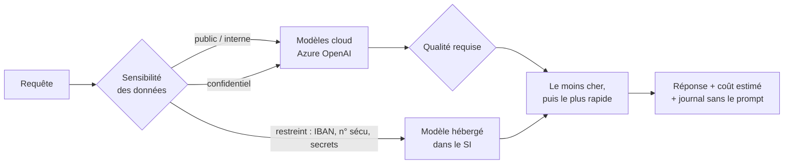

# Azure AI Gateway

Passerelle multi-LLM de référence : un point d'entrée unique devant plusieurs modèles, qui choisit pour chaque requête le modèle **autorisé**, **suffisant** et **le moins cher**.

C'est le motif que je mets en place chez les grands comptes sur Azure AI Foundry : les équipes métier appellent une seule API, la DSI garde la main sur les coûts, la sécurité et la traçabilité.

## Comment le routage décide



1. **Classification** : détection de PII et de secrets (IBAN, n° de sécurité sociale, e-mails, clés API, mots-clés RH).
2. **Conformité** : chaque modèle déclare le niveau de sensibilité maximal qu'il peut recevoir.
3. **Qualité** : la requête indique le niveau de raisonnement attendu (1 à 3).
4. **Coût puis latence** : arbitrage sur le catalogue `config/models.yaml`.
5. **Observabilité** : chaque appel est journalisé (modèle, sensibilité, latence, coût), jamais le contenu.

## Démarrer

```bash
pip install -r requirements.txt
uvicorn gateway.app:app --reload
```

```bash
curl -X POST localhost:8000/v1/chat -H "Content-Type: application/json" \
  -d '{"prompt": "Résume ce contrat pour jean.dupont@exemple.fr", "min_quality": 2}'
```

```json
{
  "model": "gpt-4o-mini",
  "sensitivity": "confidential",
  "reasons": ["sensibilité détectée : confidential", "2 candidat(s), choix du moins cher puis du plus rapide"],
  "estimated_cost_usd": 0.000309,
  "latency_ms": 2,
  "answer": null
}
```

Sans variables Azure, la passerelle tourne en **dry-run** : elle renvoie la décision sans appeler de modèle. Pour de vrais appels, copiez `.env.example` en `.env`.

## Tests

```bash
pytest -q
```

Les tests couvrent la classification, le choix du modèle et une règle non négociable : une donnée restreinte ne quitte jamais le SI.

## Pistes d'industrialisation

- Remplacer la détection par regex par **Azure AI Language (PII)**.
- Déployer derrière **Azure API Management** (quotas par équipe, authentification Entra ID).
- Ajouter un jeu d'**évaluation** (qualité des réponses par modèle) pour ajuster le catalogue.
- Exporter les journaux vers **Application Insights** pour le suivi FinOps.

---
Zakaria Khchiche · Tech Lead Data & IA · [Malt](https://www.malt.fr/profile/zakariakhchiche) · [LinkedIn](https://www.linkedin.com/in/zakariakhchiche)
